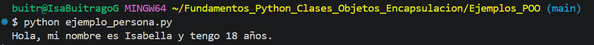
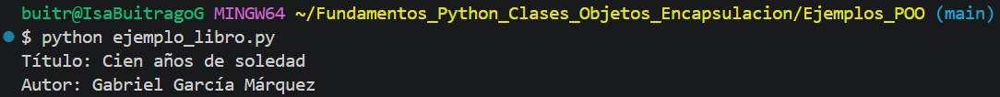
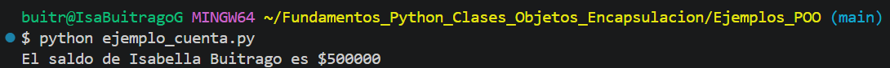
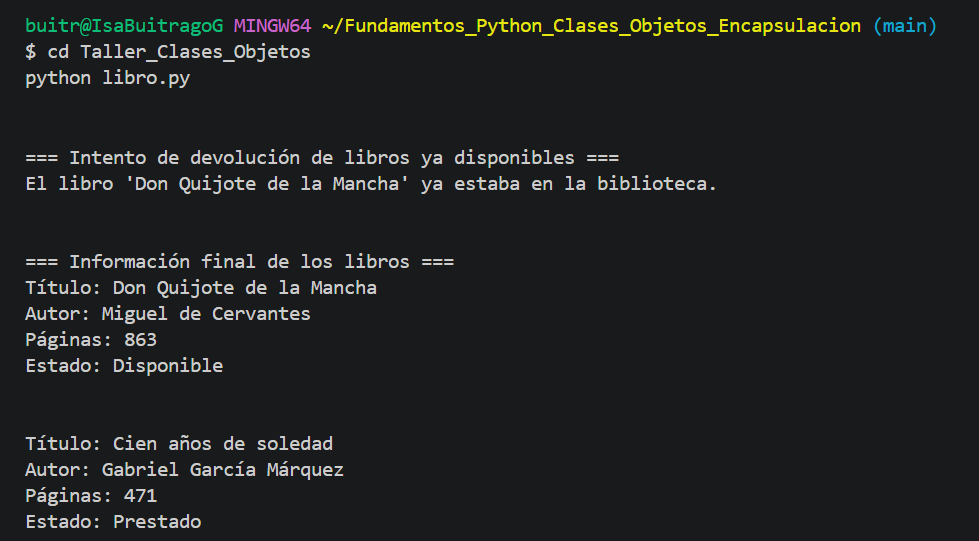
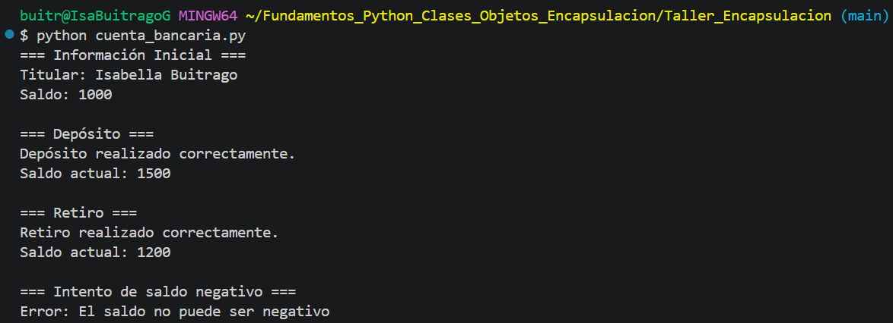
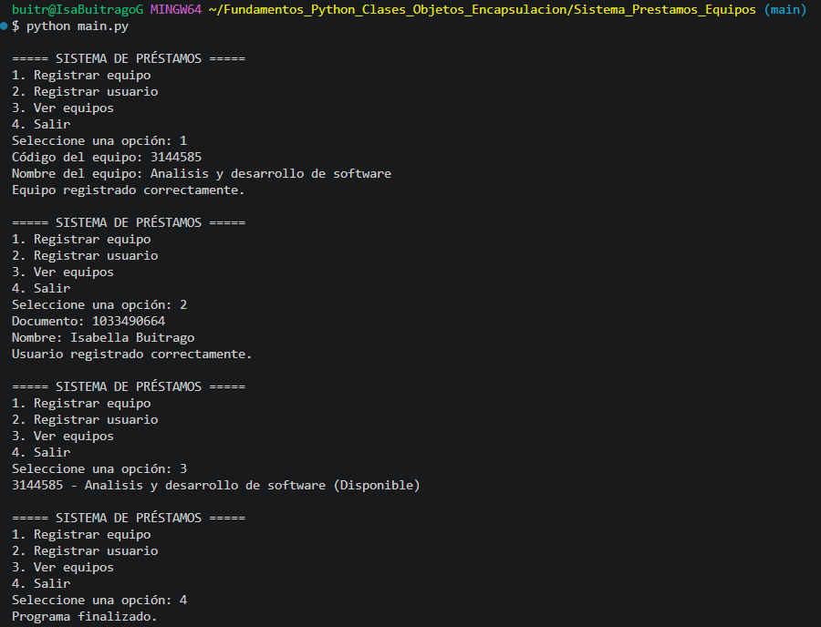
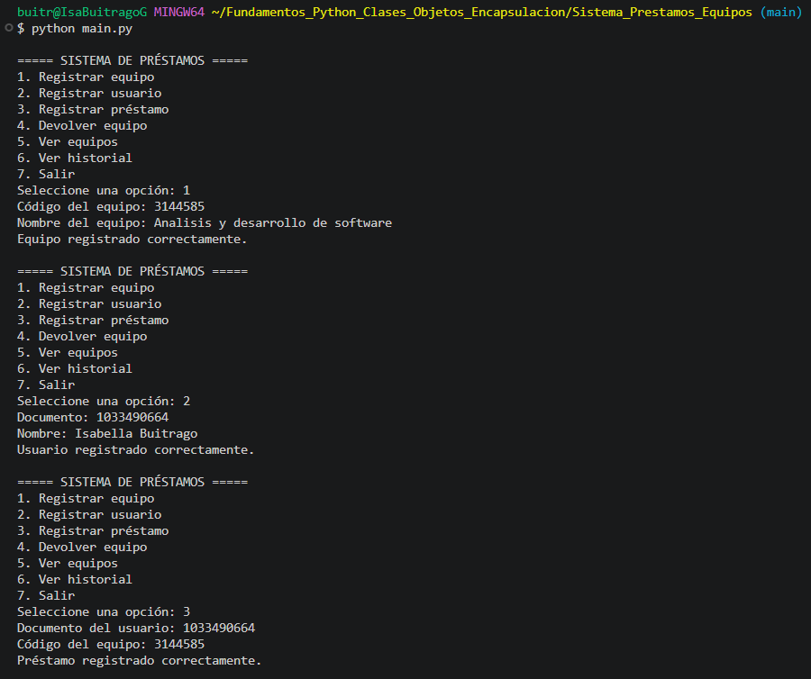
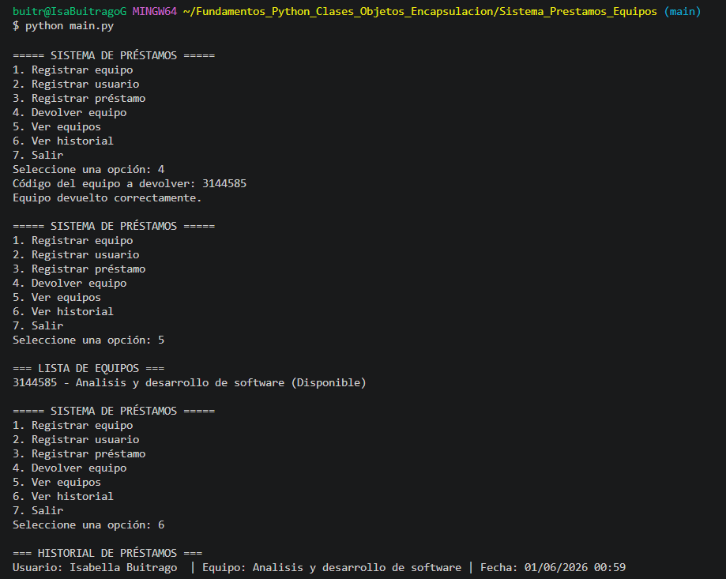

# Fundamentos de Python: Clases, Objetos y Encapsulación

## Información de la actividad

**Programa:** Análisis y Desarrollo de Software

**Evidencia:** GA1-220501093-04-AA1-EV04 – Fundamentos de Python: Clases, Objetos y Encapsulación

**Aprendiz:** Isabuitrago

---

# Descripción del proyecto

Este proyecto fue desarrollado con el propósito de aplicar los conocimientos adquiridos sobre Programación Orientada a Objetos (POO) en Python.

Durante el desarrollo de la actividad se implementaron ejemplos prácticos de clases, objetos y encapsulación. Además, se desarrolló un Sistema de Préstamos de Equipos como proyecto integrador, aplicando los conceptos fundamentales de la POO mediante clases, atributos, métodos, encapsulación y estructuras de datos.

---

# Estructura del proyecto

```text
Fundamentos_Python_Clases_Objetos_Encapsulacion
│
├── Ejemplos_POO
│   ├── ejemplo_persona.py
│   ├── ejemplo_libro.py
│   └── ejemplo_cuenta.py
│
├── Taller_Clases_Objetos
│   └── libro.py
│
├── Taller_Encapsulacion
│   └── cuenta_bancaria.py
│
├── Sistema_Prestamos_Equipos
│   ├── equipo.py
│   ├── usuario.py
│   ├── prestamo.py
│   └── main.py
│
├── images
│
└── README.md
```

---

# Temas aprendidos

## Clases

Las clases permiten representar entidades del mundo real mediante atributos y métodos que describen sus características y comportamientos.

## Objetos

Los objetos son instancias creadas a partir de una clase y permiten manipular información de manera organizada.

## Métodos

Los métodos son funciones definidas dentro de una clase que permiten realizar acciones específicas sobre los objetos.

## Encapsulación

La encapsulación permite proteger los atributos sensibles de una clase y controlar el acceso a la información mediante propiedades y métodos.

## Programación Orientada a Objetos

La Programación Orientada a Objetos facilita la reutilización del código, mejora la organización de los proyectos y permite modelar situaciones reales mediante clases y objetos.

---

# Ejemplos de Programación Orientada a Objetos

Se desarrollaron ejemplos básicos para reforzar los conceptos fundamentales de clases, objetos y métodos.

## Ejemplo Persona

Se creó una clase Persona con atributos básicos y un método para mostrar información del objeto.



---

## Ejemplo Libro

Se creó una clase Libro con atributos relacionados con la información de un libro.



---

## Ejemplo Cuenta

Se creó una clase Cuenta para representar una cuenta simple y mostrar información relacionada con el saldo.



---

# Taller de Clases y Objetos

## Clase Libro

Se desarrolló una clase llamada Libro que permite gestionar información básica de una biblioteca.

### Funcionalidades implementadas

* Registro de información del libro.
* Préstamo de libros.
* Devolución de libros.
* Consulta de disponibilidad.
* Visualización de información completa.

### Evidencia



---

# Taller de Encapsulación

## Clase CuentaBancaria

Se desarrolló una clase CuentaBancaria aplicando encapsulación mediante atributos privados y propiedades.

### Funcionalidades implementadas

* Consulta del titular.
* Consulta del saldo.
* Depósitos.
* Retiros.
* Validación de saldo negativo.

### Evidencia



---

# Proyecto Integrador: Sistema de Préstamos de Equipos

## Descripción

Se desarrolló un Sistema de Préstamos de Equipos utilizando Programación Orientada a Objetos con el fin de gestionar equipos, usuarios y préstamos dentro de una organización.

---

## Clases desarrolladas

### Clase Equipo

Representa los equipos disponibles para préstamo.

**Atributos:**

* Código
* Nombre
* Disponibilidad

**Métodos:**

* prestar()
* devolver()

---

### Clase Usuario

Representa a los usuarios registrados en el sistema.

**Atributos:**

* Documento
* Nombre

---

### Clase Prestamo

Representa la relación entre un usuario y un equipo prestado.

**Atributos:**

* Usuario
* Equipo
* Fecha

---

### Archivo Main

Contiene el menú principal y coordina la interacción entre todas las clases del sistema.

---

# Funcionalidades implementadas

* Registro de equipos.
* Registro de usuarios.
* Registro de préstamos.
* Devolución de equipos.
* Consulta de equipos.
* Historial de préstamos.
* Gestión de disponibilidad de equipos.

---

# Evidencias del Sistema

## Menú Principal Inicial

Versión inicial del sistema donde se implementaron las funcionalidades básicas:

- Registro de equipos.
- Registro de usuarios.
- Consulta de equipos.



---

## Menú con Nuevas Funcionalidades

Versión mejorada del sistema incorporando nuevas funcionalidades:

- Registro de préstamos.
- Devolución de equipos.
- Consulta de historial de préstamos.
- Gestión de disponibilidad de equipos.
- Mejoras en la navegación del menú.




---

# Conclusión

Durante el desarrollo de esta actividad fortalecí mis conocimientos en Programación Orientada a Objetos mediante la implementación de clases, objetos, métodos y encapsulación en Python.

Además, aprendí a estructurar proyectos de software de forma organizada, utilizar Git y GitHub para el control de versiones y documentar adecuadamente el desarrollo de una aplicación.

El Sistema de Préstamos de Equipos permitió integrar todos los conceptos aprendidos en una solución práctica, fortaleciendo mis habilidades de programación, análisis y resolución de problemas.
